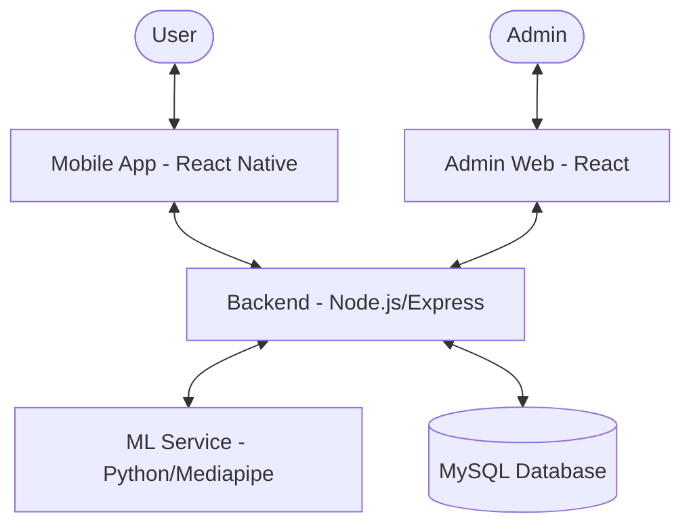

# Fitness App Ecosystem

A comprehensive fitness platform featuring a mobile application for users, a backend with AI/ML capabilities for pose recognition, and a web-based admin dashboard.

## 🚀 Project Overview

This ecosystem is designed to provide users with a complete health and fitness tracking experience. It leverages AI to analyze exercise form through computer vision and provides personalized workout and nutrition recommendations.

### 🍱 Main Components

- **[Backend](backend/README.md)**: A Node.js Express server integrated with a Python ML service for real-time pose analysis.
- **[Fitness App](fitness-app/README.MD)**: A React Native (Expo) mobile application for users to track workouts, nutrition, and analyze their poses.
- **[Admin Web](admin-web/README.md)**: A React-based web dashboard (Vite) for system administration.

## 🏗️ Architecture

## 🛠️ Technology Stack

| Component | Technologies |
| :--- | :--- |
| **Mobile App** | React Native, Expo, Axios, React Navigation |
| **Backend** | Node.js, Express, Sequelize (ORM), Socket.IO, JWT |
| **AI/ML** | Python, Mediapipe, TensorFlow.js |
| **Web Dashboard** | React, Vite, Tailwind CSS |
| **Database** | MySQL |

## 🏁 Getting Started

To get the entire system running, follow the setup guides in each sub-directory:

1.  **Backend Setup**: Follow instructions in `/backend/README.md`.
2.  **Mobile App Setup**: Follow instructions in `/fitness-app/README.MD`.
3.  **Admin Web Setup**: Follow instructions in `/admin-web/README.md`.

## 📁 Project Structure

- `backend/`: Node.js server and API logic.
- `fitness-app/`: Mobile application source code.
- `admin-web/`: Administrator dashboard source code.
- `docs/`: Reference documentation, SQL dumps, and reports.
- `tmp/`: Temporary processing files (ignored by git).

---

© 2024 Xuan Duc - Do An Chuyen Nganh 2
