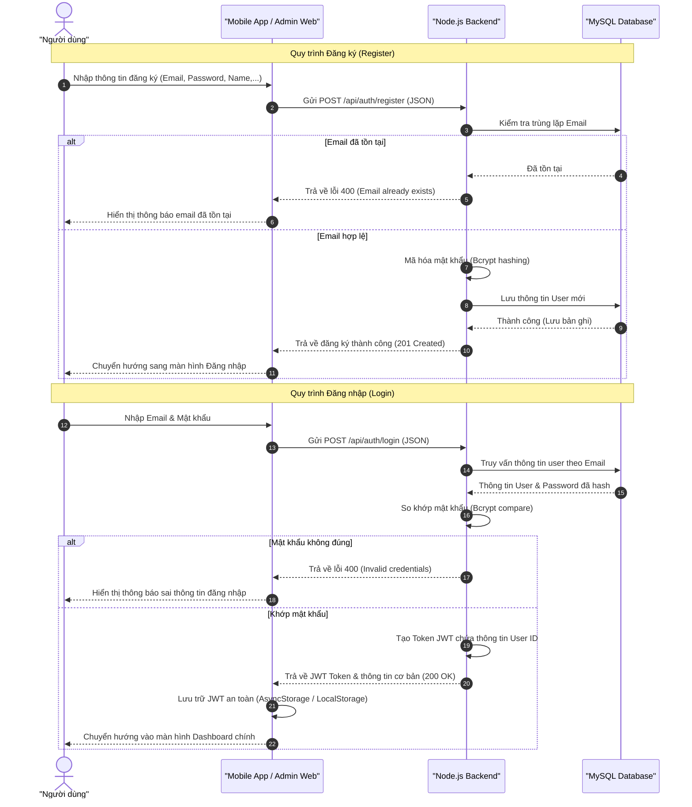
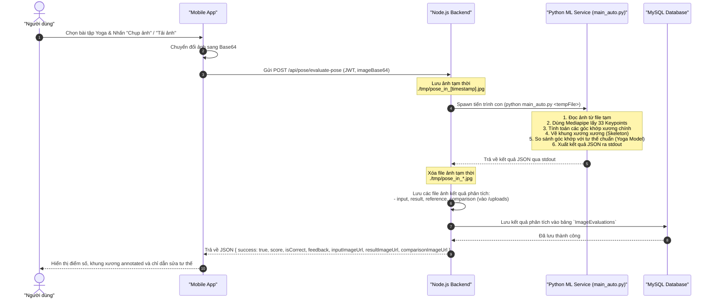
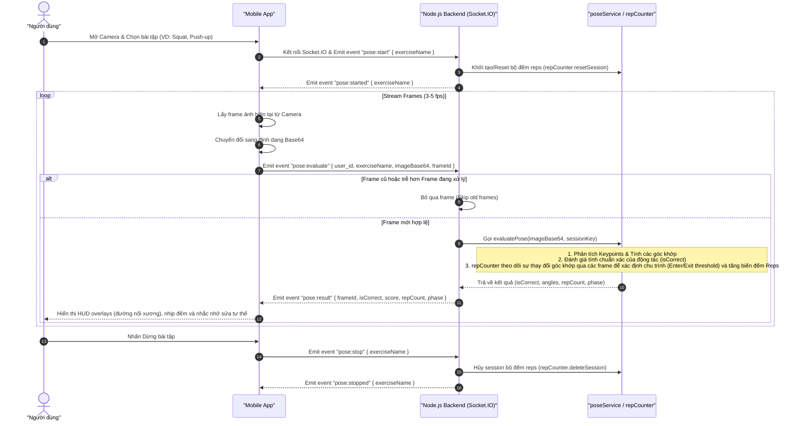
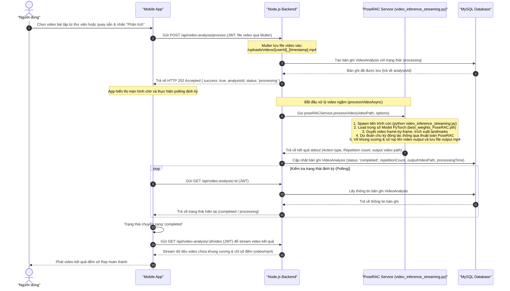
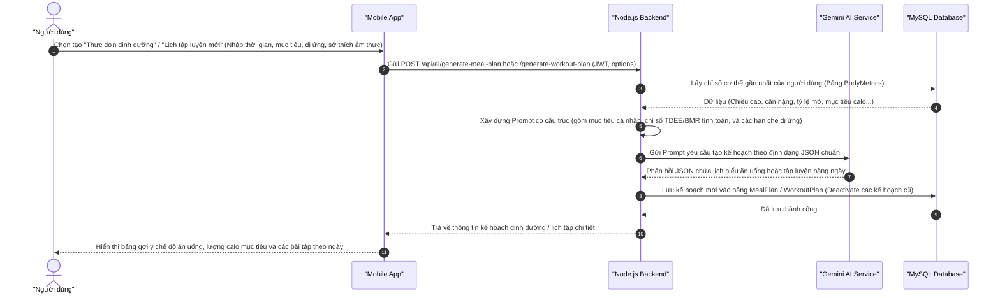
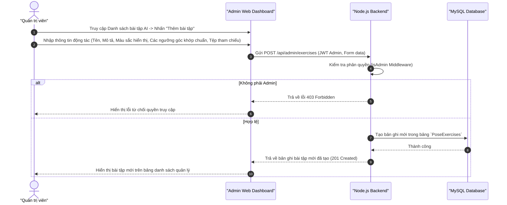

# 🔄 Các luồng nghiệp vụ chi tiết (System Workflows)

Tài liệu này mô tả chi tiết các luồng nghiệp vụ và luồng dữ liệu (Data & Logic flows) trong **Hệ thống hỗ trợ tập luyện AI (AI Fitness Training App)**. Các sơ đồ tuần tự (Sequence Diagram) dưới đây thể hiện sự tương tác giữa Mobile App, Admin Web, Backend API (Node.js/Express/Socket.IO), cơ sở dữ liệu MySQL và các dịch vụ AI/ML (Python, Mediapipe, PoseRAC, Gemini AI).

---

## 👥 I. Nhóm Người dùng (User Workflows)

### 1. Đăng ký & Đăng nhập (Authentication & Authorization)
Mô tả quy trình đăng ký tài khoản mới và đăng nhập nhận mã thông báo JWT để phân quyền truy cập hệ thống giữa Client (Mobile/Web) và Backend.

---

### 2. Phân tích tư thế tĩnh qua ảnh (Static Pose Evaluation via REST API)
Mô tả quy trình chụp ảnh/gửi ảnh từ Mobile App lên Backend để gọi dịch vụ Python phân tích tư thế Yoga tĩnh, so sánh góc khớp xương với hình mẫu và trả về đánh giá chi tiết.

---

### 3. Phân tích tư thế thời gian thực (Real-time Pose WebSocket)
Mô tả luồng truyền trực tiếp (stream) các frame ảnh camera của người dùng qua kết nối WebSocket (Socket.IO) để nhận phản hồi phân tích khung xương và đếm số rep liên tục với độ trễ cực thấp.

---

### 4. Phân tích video đếm số rep bất đồng bộ (Asynchronous Video Repetition Counting)
Mô tả quy trình tải lên một video bài tập đã quay sẵn. Node.js backend ghi nhận yêu cầu và xử lý ngầm (asynchronous background worker) bằng mô hình AI PoseRAC thông qua tiến trình Python chuyên sâu, xuất ra video thành phẩm có vẽ khung xương và đếm rep tự động.

---

### 5. Gợi ý chế độ ăn & tập luyện cá nhân hóa (Gemini AI Recommendations)
Mô tả quy trình thu thập dữ liệu sức khỏe của người dùng, tạo prompt ngữ cảnh gửi tới Gemini AI, lưu trữ kế hoạch dinh dưỡng/bài tập vào DB và trả về kết quả cá nhân hóa cho người dùng.

---

## ⚙️ II. Nhóm Quản trị (Admin Workflows)

### 1. Quản lý Thư viện Bài tập & Cấu hình Động tác
Mô tả cách thức quản trị viên quản lý, thêm mới hoặc chỉnh sửa các động tác tập luyện hỗ trợ khung xương AI trên trang Admin Web Dashboard.

